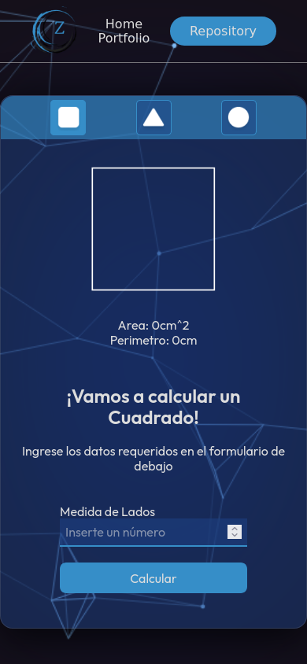

# curso-p-javascript

 

## Taller #1: Figuras Geometicas

- Primer Paso: Definir las Formulas
- Segundo Paso: Implementar Fórmulas en JavaScript.
- Tercer Paso: Crear Funciones.
- Cuarto Paso: Integrar JS con HTML.

## Versión Desktop

## Versión Mobile
